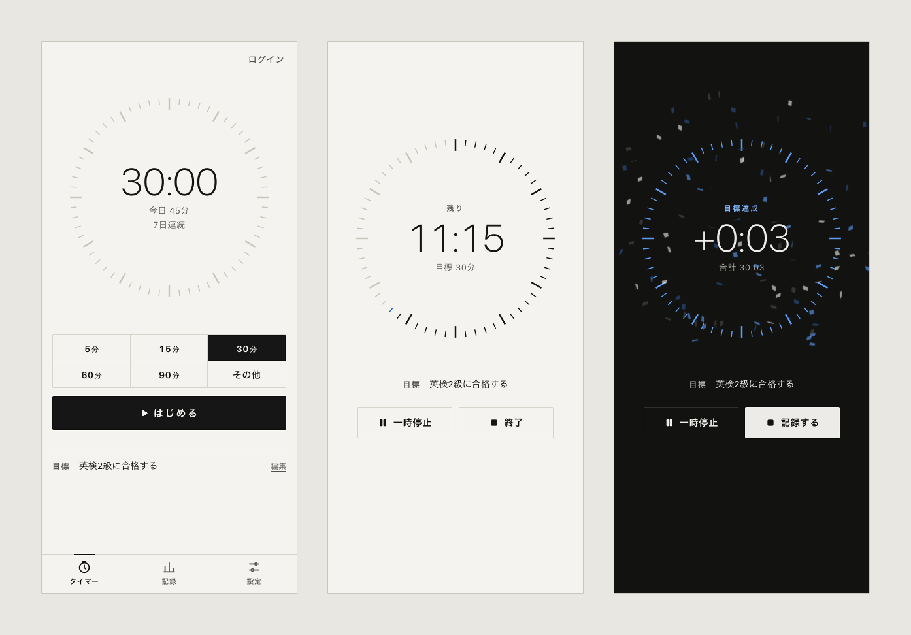
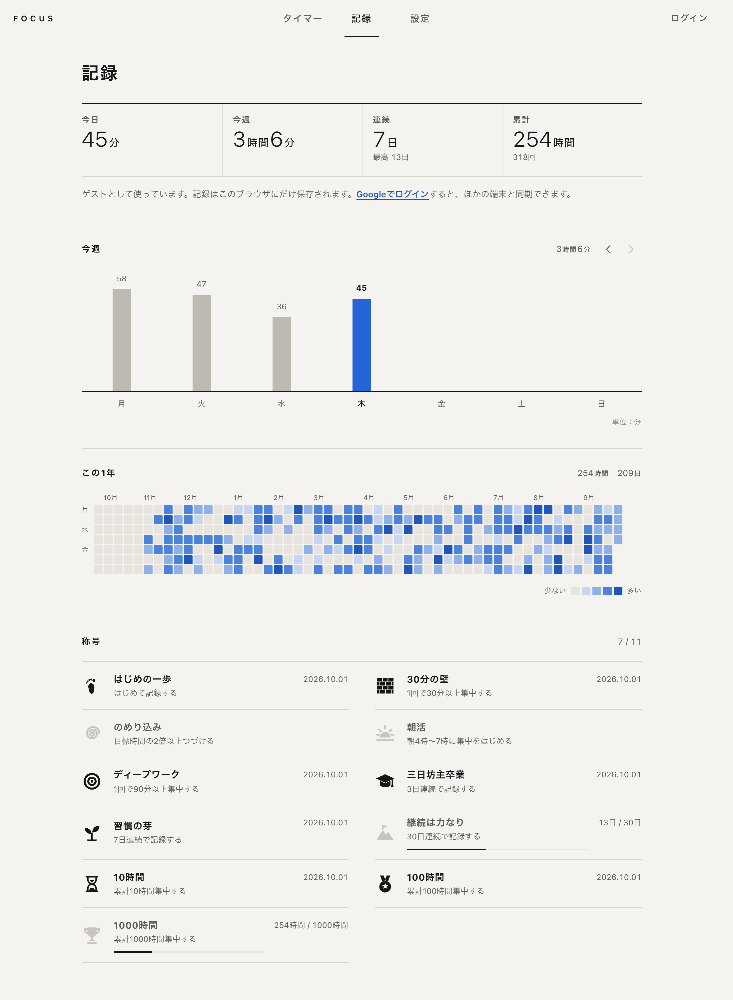

<p align="center">
  
</p>

<h1 align="center">Focus</h1>

<p align="center">
  「とりあえず5分」から始める作業タイマー<br>
  <a href="https://izu-focus.web.app/"><b>izu-focus.web.app</b></a> ・ <a href="README.en.md">English</a> | 日本語
</p>

<p align="center">
  
</p>

作業を始めるハードルを下げ、続けられるようにするためのタイマーです。目標時間は5分から設定できます。「とりあえず5分だけ」と始めてみると、気付けば30分、1時間と集中できている——そんな状況を生み出すことを狙っています。

## 特長

- **開いてすぐ使える** — ログインは不要です。記録はブラウザに保存され、Google でログインするとアカウントに引き継いで、ほかの端末と同期できます。
- **ワンタップで開始** — 5・15・30・60・90分から選んで「はじめる」。「その他」で1〜240分に調整できます。
- **集中を邪魔しない** — 作業中はメニューが隠れ、しばらく触らないとボタンも薄くなります。目標の時間を過ぎてもそのまま続けられます。
- **気づける** — 目標の時間になると紙吹雪とチャイム、通知で知らせます。タブのタイトルにも残り時間が出ます。
- **途中で閉じても大丈夫** — リロードしたりタブを閉じたりしても、作業は続きから再開します。オフラインでも使え、記録はつながったときに送信されます。
- **積み重ねが見える** — 今日・今週・連続日数・累計、週のグラフ、1年分のヒートマップ、11種類の称号。
- ダークモードと、スマートフォンのホーム画面への追加（PWA）に対応しています。

<p align="center">
  
</p>

## 使い方

| 操作 | 動作 |
| --- | --- |
| 時間を選んで「はじめる」 | 作業開始。パソコンではスペースキーでも開始・一時停止・再開できる |
| 「一時停止」/「再開」 | 止めていた時間は記録に含まれない |
| 「終了」 | 記録して、今日の合計や新しい称号を表示する（1分未満は記録しない） |
| 「この記録を取り消す」 | 終了した直後なら、押し間違いなどの記録を取り消せる |
| 「目標を決める」 | 「英検2級に合格する」など。作業中もタイマーの下に表示される |

## 開発

### 必要なもの

- Node.js 22.12 以降
- ログインまわりを試す場合は、Firebase エミュレーター用の Java 21 以降（`brew install openjdk` で入れた場合は `export PATH="/opt/homebrew/opt/openjdk/bin:$PATH"`）

### 起動

```bash
npm install
npm run dev        # http://localhost:5173
npm test           # テスト
npm run lint
```

開発中は本番の Firebase ではなく、ローカルのエミュレーターにつながります。ログインや同期を試すときは、別のターミナルでエミュレーターを起動してください。本番の Firebase につなぎたいときは、`.env.local` に `VITE_FIREBASE_CONFIG='{"apiKey":"…","authDomain":"…","projectId":"…","appId":"…"}'` を書きます（コミットされません）。

```bash
npm run emulators
```

### 公開

Firebase Hosting（サイト `izu-focus`）に公開します。Firebase の設定はリポジトリやビルドに含めず、公開先で Hosting が配信する `/__/firebase/init.json` から読み込みます。

```bash
npx firebase-tools@15 login   # 初回のみ
npm run deploy                # ビルドして Hosting に公開
```

Firestore のセキュリティルールは [`firestore.rules`](firestore.rules) にあり、`npx firebase-tools@15 deploy --only firestore:rules` で反映できます。

### 画像を作り直す

```bash
npm run og                                  # SNS 用のプレビュー画像（public/og.png）
npm run screenshots -- http://localhost:5173  # README の画像（開発サーバーの起動中に）
```

スクリーンショットはヘッドレスの Chrome に架空のデモデータを入れて撮影します。実際の画面やブラウザのデータは使いません。

### データ

記録は Firestore の `users/{uid}` の1ドキュメントにまとめています（ゲストはブラウザの localStorage に同じ形で保存）。

| フィールド | 内容 |
| --- | --- |
| `totalTime` | 累計（秒） |
| `daily` | 日ごとの秒数 `{ "2026-10-01": 1500 }` |
| `sessions` / `longest` | 記録した回数 / 1回の最長（秒） |
| `titles` | 手に入れた称号と、その日付 |
| `goal` | 目標 |
| `ops` | 反映済みの操作 ID（再送しても二重に記録しないため） |

2024年までの旧版のデータ（`aWeekTotalTime` など）は、新しい版で初めて開いたときに自動で移行します。旧版は日ごとの記録を最後に開いた週の分しか持っていなかったため、それより前の記録は累計にだけ含まれます。
